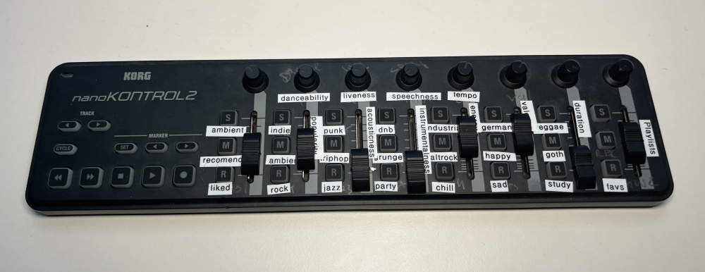

# moodsporgan

[Mood Organ](https://en.wikipedia.org/wiki/Penfield_mood_organ)
for the Spotify Recommendation API



Use a MIDI controller to play recommended songs on Spotify.

Adjust knobs and faders to set target
*acousticness*,
*instrumentalness*,
*danceability*,
*energy*,
*valence*,
*liveness*,
*speechiness*,
*tempo*,
*duration*,
*popularity*.

Hold down buttons to pick seed genres.

Press *cycle* to play 42 recommended songs 🥳

## Status

A hack for my personal use. I use it now and then. It's fun.

Code has hard-coded settings that should be configuration.

Code has bugs that should be no bugs.

## Idea

The idea originated in combining two ideas.
MIDI controllers for home automation and having fun with the
  Spotify API's recommendation feature.

MIDI controllers can make good and cheap home automation buttons.
I like buttons to trigger things at home.
Unfortunately most home automation input devices are only 1-5 buttons.
Usually without any knobs or sliders. Sometimes with double click and hold / release.
MIDI controllers, I discovered, are pretty amazing.
Lots of knobs, sliders, buttons with high quality at a good price point.

Java has built-in MIDI support.
Which means my favorite language (Clojure - not Java) can do MIDI.

Spotify has a [recommendation API](https://developer.spotify.com/documentation/web-api/reference/get-recommendations)
  with lots of 0-1 continuous inputs.
I already have a ton of small scripts to integrate Spotify into my digital live.
Browsing the API docs I found the recommendation API.
It takes a massive amount of parameters.
Some fun ones like "danceability" or "energy".
Using that without any kind of UI wouldn't be fun.
Since I had the MIDI controller and Clojure code to get input from it around,
I figured, why not use the sliders and faders to input all this values?

Knobs and sliders aren't enough. The API wants a *seed*.
Luckily the MIDI controller has a lot of Mute, Solo, Record buttons.
Most are assigned to seed by genres. Some to playlists.

Combining the MIDI hardware, a bit of Clojure glue and the Spotify API
we get a sort of organ to create ad hoc playlists for every mood.

## Implementation Notes

Clojure with the only *real* dependency being a Spotify API Java client.

Uses [javax.sound.midi](https://docs.oracle.com/en/java/javase/11/docs/api/java.desktop/javax/sound/midi/package-summary.html)
to get the button events.

A bit of code maps MIDI events to Clojure keywords for better legibility.

## Usage

**To run this software you need a Spotify developer account.**

1st run. Authenticate and cache credentials. Creates a `/var/tmp/moodsporgan-tokens.edn` file.

```sh
lein run -- --spotify-client-id SPOTIFY_CLIENT_ID --spotify-client-auth SPOTIFY_CLIENT_AUTH --auth
```

N+1th run.

```sh
lein run -- --spotify-client-id SPOTIFY_CLIENT_ID --spotify-client-auth SPOTIFY_CLIENT_AUTH
```
